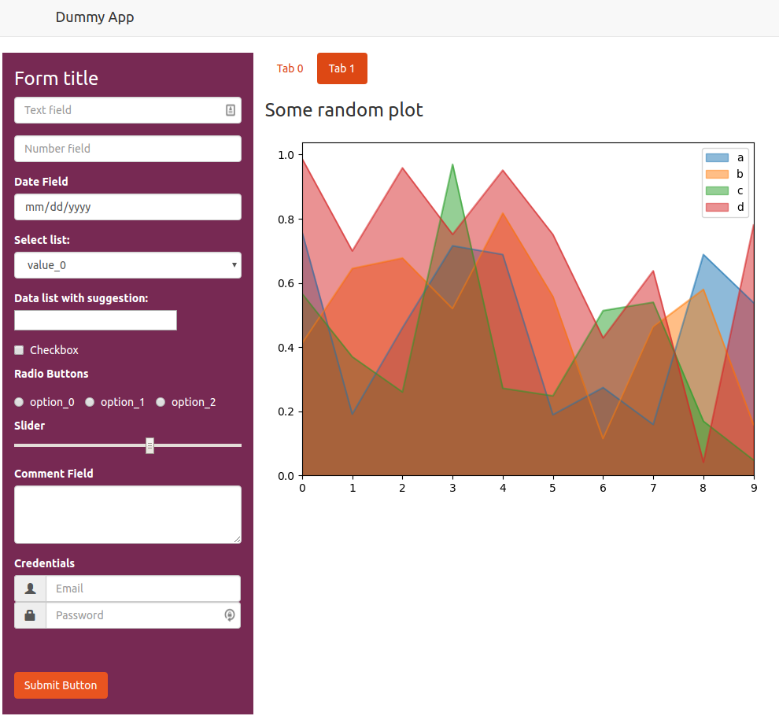
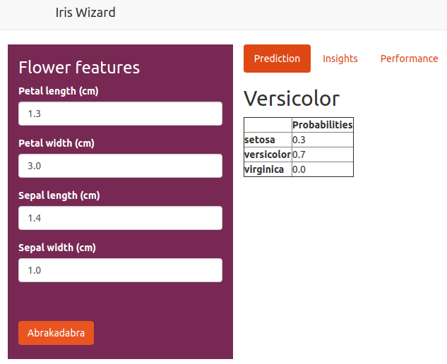
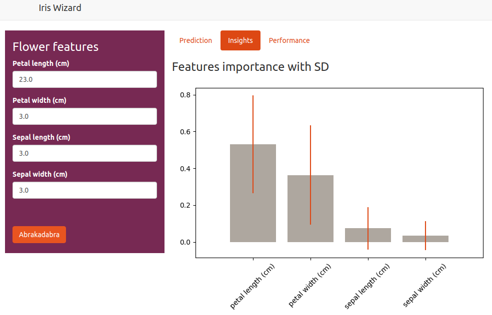
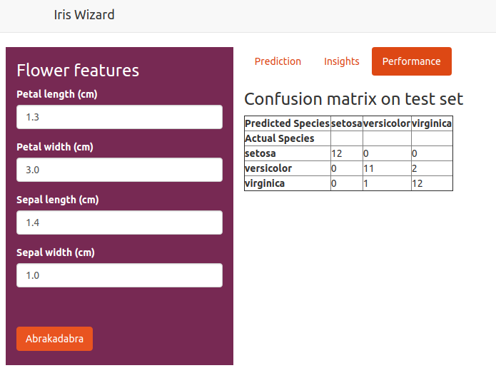

# app-skeleton

Flask Python application example/skeleton/template, which can be run in production using Gunicorn. It includes the corresponding Dockerfile example to easily containerize your application (check the **Docker** section).

I am NOT a software developer nor do I want to be one. I think this skeleton can help transition from a machine learning model into a machine learning application, where end users (not data scientist or analysts) can actually make effective use of your model advice.

The application demonstrates several uses, just pick and choose the parts depending on your requirements. Perhaps you are not interested in having an UI, then the endpoint example in the iris case (check the section **Model prediction example**) together with the Gunicorn extension of the Flask app is what you need.

There are two examples, the first is just a dummy example of how to ingest a user's input of different types. The second example runs a classifier which predicts the type of iris flower depending on input from a html form, it also provides some extra output related to the model used.

The idea is to use these examples to easily customize your own Python application. 

As you can see in the pictures I use the typical [shiny](https://shiny.rstudio.com/) layout, which in my opinion, is very practical for small machine learning applications.

I do not use java script nor jquery, is only Python. Actually there is a very small javascript code on the submission of the form, this is to avoid sending empty inputs in the post request..



## Contents

 - Flask application containing a dummy example and another example using a RandomForestCassifier (Iris Wizard) in `app/app.py`.
 - Input form with many input types examples `app/templates/input_dummy.html`.
 - Input form for the Iris classifier`app/templates/input_iris.html`.
 - Interactive layout which generates output from the input forms.
 - Class wrapper to extend the Flask application using Gunicorn `app/resources/gunicorn_wrapper.py`.
 - Example class which handles the dummy form submission `app/resources/form_submitter_dummy.py`.
 - Example class which handles the iris form submission `app/resources/form_submitter_iris.py`.
 - Function which runs a Flask application using Gunicorn, and handles multiple command line arguments `app/run_app.py`.
 - Folder with all necessary files for putting the application into a Docker container `docker`.

## Run application

First install the `dummypackage` by executing
```bash
python setup.py install
```
Once you are building your own package you should keep a similar structure as best practice. You can read more about it (here)[https://blog.godatadriven.com/how-to-start-a-data-science-project-in-python].

To run the application execute the command
```bash
python run_app.py [Options]
```
where `Options` are a few of Gunicorn's possible optional settings. To see which settings can be specified execute `python app/run_app.py --help`. Except for the `--debug` argument (more in the **Run in debug mode** section), all others have a one-to-one relationship with a Gunicorn setting.

By default if running without options `python run_app.py`, `loglevel` will be set to `info`, `workers` and `threads` to `1`, and the application will be hosted in `localhost` under `port` `5000`.

**Note if running in production**: Check out the different options, specially, workers, workers type, threads, access log, error log and daemon mode.

[Here](http://docs.gunicorn.org/en/stable/settings.html) is a list of all Gunicorn's settings, including the default values.

## Run in debug mode
In short, by running in debug mode you will use a single process, log level will be set to debug and process will restart when code or html changes.

You can run in debug mode by executing
```bash
python run_app.py --debug
```
this will ovewrite the following Gunicorn settings:

 -  `loglevel = 'debug'`
 - `reload = True`
 - `threads = 1`
 - `workers = 1`
 - `worker_class = 'sync'`

 In addition it will overwrite some Flask configuration settings

  - `app.jinja_env.auto_reload = True`
  - `app.config['TEMPLATES_AUTO_RELOAD'] = True`

## Run as native Flask application

If you still want to run the application as a native Flask application without gunicorn you can do that by executing

```bash
export FLASK_APP=app/app.py; flask run [Options]
```
in this case the `Options` are more limited. More information can be found [here](http://flask.pocoo.org/docs/0.12/quickstart/).

## Docker

Inside the docker directory I have included a simple Dockerfile to build and run the docker image of our application.

To build the docker image execute from the root diretory of this repository
```bash
docker build --build-arg port=PORT -t app-skeleton -f docker/Dockerfile .
```
where `PORT`should be replaced by the port number dedicated for your application. 
After building the image succesfully, you can run the container on the foreground by executing
```bash
docker run -p PORT:PORT app-skeleton --host 0.0.0.0 --port PORT
```
where `PORT` is the same port number as above. If you wish to run the container in the background execute
```bash
docker run -d -p PORT:PORT app-skeleton --host 0.0.0.0 --port PORT
```
The above options `--host 0.0.0.0` and `--port PORT` are the minimum requirements to view your application by opening you browser and going to the url address `127.0.0.1:5000`.

If the application will be running in production you can still send to the `run` command the same aguments as before
```bash
docker run -d -p PORT:PORT app-skeleton --host 0.0.0.0 --port PORT [OPTIONS]
```

## Model prediction example

The model example consist on the classification of the iris dataset.
The model is trained when the application starts such that there is no need training time lost when a user submits a new request (an idea here is to have a refresh endpoint which re-trains the model on demand with new data for example).

By pressing the button `Abrakadabra` the prediction and other related information is generated, as the figures below show.





A similar post request can be made to the same endpoint returning a different reponse, in this case just the name of the class predicted. This is useful if you plan to make the API available to other applications. 
This can be tested with the following example, by executing (if application is running on localhost)

in the command line
```bash
curl --data "petal_length_cm=1&petal_width_cm=1&sepal_length_cm=1&sepal_width_cm=1" http://localhost:5000/iris-wizard
```
or in python
```python
request = {'petal_length_cm': 1,
           'petal_width_cm': 1,
           'sepal_length_cm': 1,
           'sepal_width_cm': 1}
requests.post('http://localhost:5000/iris-wizard', data=request).json()
```

